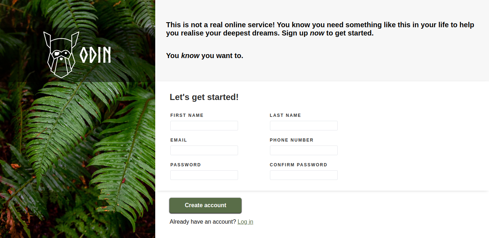

# Sign-Up-Form

Table of Contents

1. [About The Project](#about-the-project) 
2. [Built With](#built-with)  
3. [Screenshots](#screenshots)  
3. [Contact](#contact)  
4. [Acknowledgements](#acknowledgements)

## About The Project

### Features:

- Frontend of a Sign-Up form.
- Features form validations - both passwords must be same, and email and phone number must be in correct format.
- Invalid fields are indicated in display.
- Prevents invalid form submission.
- Responsive design.

<a href="#top">Back to top</a>

### Built With

 

## Preview

  

<a href="#top">Back to top</a>

## Video Demo 

[Video Demo here.](design/preview_vid.webm)

## Contact

LinkedIn: [Trisha Seal](https://linkedin.com/in/trisha-seal)  
GitHub: [@EmberTSeal](https://github.com/EmberTSeal)

## Acknowledgements

Design by The Odin Project, developed by me as part of The Odin Project, 2023.

<a href="#top">Back to top</a>

